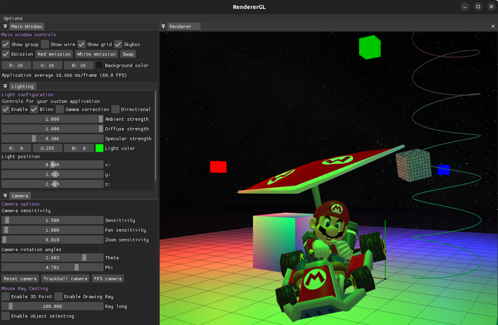
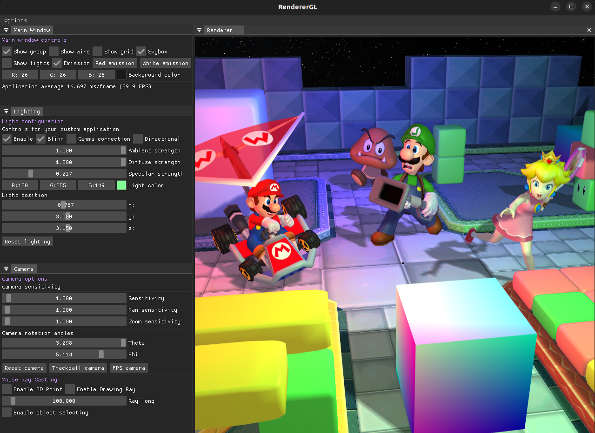
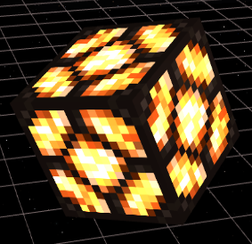
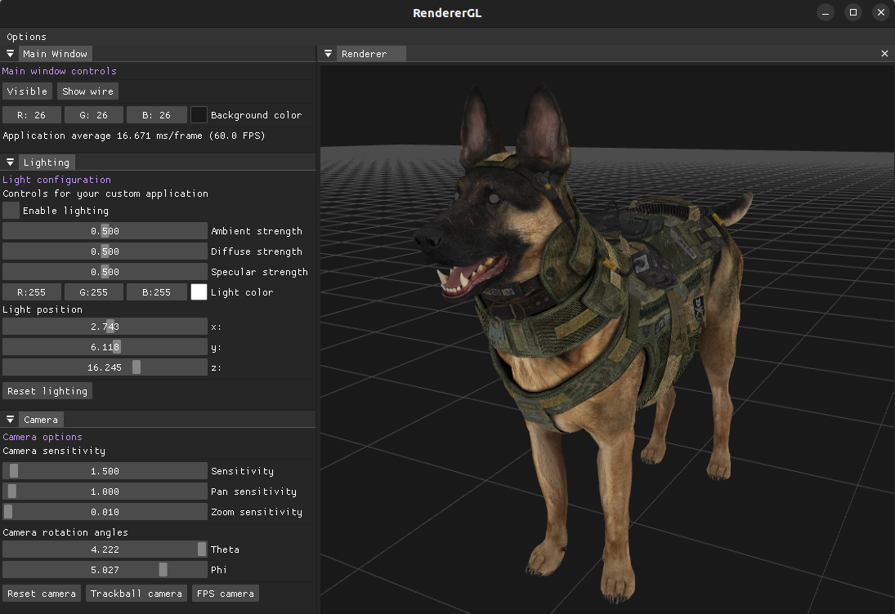

# RendererGL

RendererGL is a 3D renderer written in C++ and OpenGL. The main objective of this project is to create a framework that allows working with 3D graphics without the need to know computer graphics or OpenGL. So that both beginners and more experienced programmers can create a 3D scene with lighting, shadows and more advanced 3D models in an easy way.

> **Warning** This project is still under development

*The file **main.cpp** is an example file using ImGui and RendererGL*

Take a look at some [screenshots](#screenshots)

## Features

* Trackball and first person shooter camera
* Polytopes and groups of polytopes
* Dynamic polytopes
* Polytope face culling
* Blending
* Anti aliasing (MSAA)
* Textures
* Load 3D models and textures from files: .obj, .dae, ...
* Skybox (cubemap)
* FrameCapturer (create a texture of the scene)
* Blinn-Phong lighting
* Emission
* Shadow Mapping (percentage closer filtering)
* Normal Mapping
* Gamma correction
* HDR
* Mouse ray casting
* Object selection
* Scene Graph

### Scene Graph

A [scene graph](https://en.wikipedia.org/wiki/Scene_graph) is a general data structure commonly used by vector-based graphics editing applications and modern computer games, which arranges the logical and often spatial representation of a graphical scene. It is a collection of nodes in a graph or tree structure:

* **Polytope:** A set of vertices and indices (optional) that defines a shape
* **Group:** A set of polytopes
* **Model:** A group which contains a set of polytopes that are loaded from a file (*.obj*, *.dae*, *...*)
* **Scene:** Contains a set of groups, models and other scenes
* **Renderer:** Contains a set of scenes. It's the one who deals with all the graphics stuff

*Take a look at the example below*

## Example: simple rotating cube

```cpp
#include "engine/window/Window.h"
#include "engine/renderer/Renderer.h"
#include "engine/renderer/TrackballCamera.h"

Renderer::Ptr renderer;

// x y z  r g b
std::vector<Vec3f> cubeVertices {
    Vec3f(-0.5, -0.5,  0.5,   0.0f, 0.0f, 1.0f),
    Vec3f( 0.5, -0.5,  0.5,   1.0f, 0.0f, 1.0f),
    Vec3f( 0.5,  0.5,  0.5,   0.0f, 1.0f, 1.0f),
    Vec3f(-0.5,  0.5,  0.5,   0.0f, 1.0f, 0.5f),
    Vec3f(-0.5, -0.5, -0.5,   0.0f, 0.0f, 1.0f),
    Vec3f( 0.5, -0.5, -0.5,   1.0f, 0.0f, 1.0f),
    Vec3f( 0.5,  0.5, -0.5,   0.0f, 1.0f, 1.0f),
    Vec3f(-0.5,  0.5, -0.5,   0.0f, 1.0f, 0.5f)
};

std::vector<unsigned int> cubeIndices {
    0, 1, 2,  1, 5, 6,  7, 6, 5,
    2, 3, 0,  6, 2, 1,  5, 4, 7,
    4, 0, 3,  4, 5, 1,  3, 2, 6,
    3, 7, 4,  1, 0, 4,  6, 7, 3 
};

int main() {

    Window window("Perspective cube example", 500, 400);

    renderer = Renderer::New(window.getWidth(), window.getHeight());

    double aspectRatio = static_cast<double>(window.getWidth()) / window.getHeight();
    TrackballCamera camera = TrackballCamera::perspectiveCamera(glm::radians(45.0f), aspectRatio, 0.1, 1000);
    camera.zoom(-2.5);
    renderer->setCamera(camera);

    Polytope::Ptr polytopeCube = Polytope::New(cubeVertices, cubeIndices);

    Group::Ptr group = Group::New();
    group->add(polytopeCube);

    Scene::Ptr scene = Scene::New();
    scene->addGroup(group);

    renderer->addScene(scene);

    while (!window.windowShouldClose()) {

        // Update scene
        polytopeCube->rotate(0.55, glm::vec3(1, 0, 1));

        // Draw scene
        renderer->clear();
        renderer->render();
        window.update();
    }

    return 0;
}
```

## Screenshots

**Multiple point lights**



**Shadows**



**Emission**



**Call of Duty Ghost dog**



## Contribution

RendererGL is an open source project under the MIT licence. Feel free to fork it and contribute

## Dependencies

* [GLFW](https://github.com/glfw/glfw) for creating a window with an OpenGL context
* [GLEW](https://github.com/nigels-com/glew) for loading OpenGL extensions
* [GLM](https://github.com/g-truc/glm) for linear algebra stuff
* [IMGUI](https://github.com/ocornut/imgui) for the user interface
* [ASSIMP](https://github.com/assimp/assimp) for loading 3D models from files (*.obj*, *.dae*, *...*)
* [STB](https://github.com/nothings/stb) for loading images from files (*.png*, *.tga*, *.jpg*, *...*)

## References

Dealing with OpenGL was much easier thanks to:

* [Learn OpenGL](https://learnopengl.com/)
* [The Cherno](https://www.youtube.com/@TheCherno)
* [ThinMatrix](https://www.youtube.com/@ThinMatrix)