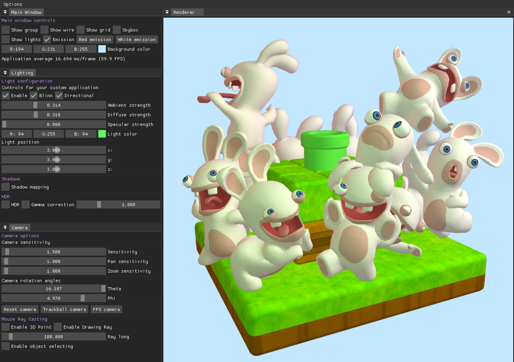
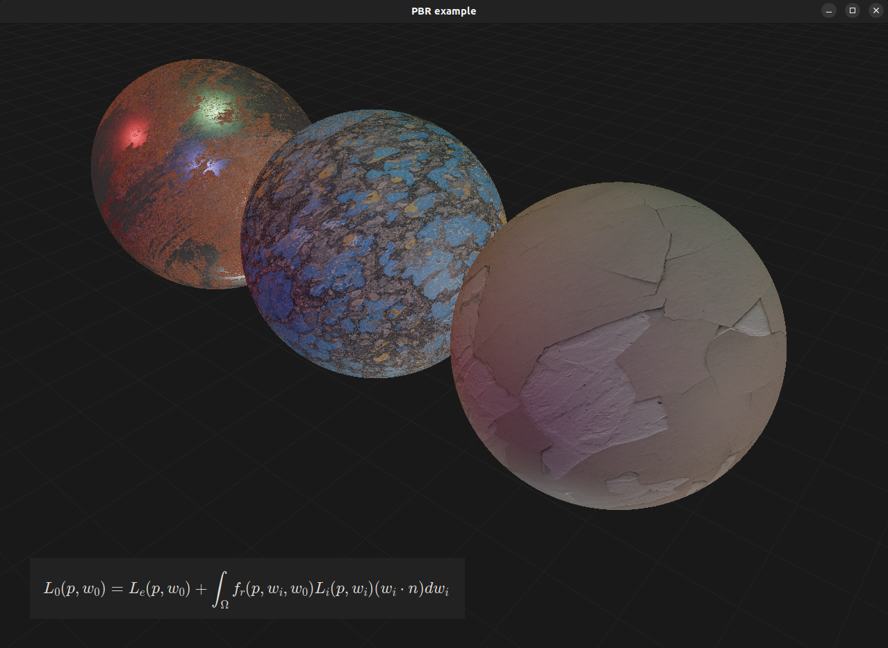
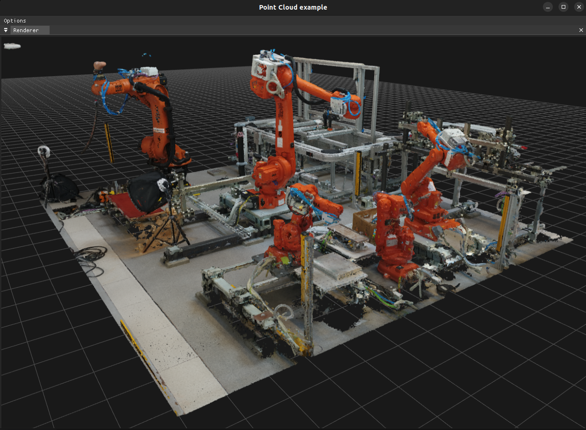

# RendererGL

RendererGL is a basic 3D renderer written in C++ and OpenGL that allows working with 3D graphics without the need to know computer graphics or OpenGL. So that both beginners and more experienced programmers can create a 3D scene with lighting, shadows and materials.

> **Warning** This project is still under development

Take a look at some [screenshots](#screenshots). *3D assets are not included*

## Features

* **Trackball and first person shooter camera**
* **Anti aliasing (MSAA)**
* **Textures**
* **Load 3D models and textures from files**
* **Skybox (cubemap)**
* **FrameCapturer:** create a texture of the scene
* **Blinn-Phong lighting:** Ambient, Diffuse, Specular, Emission
* **Physically Based Rendering (PBR):** Albedo, Metallic, Normal, Roughness, Ambient Occlusion, Emission
* **Shadow Mapping:** percentage closer filtering
* **Normal Mapping**
* **Gamma correction**
* **HDR**
* **Mouse ray casting:** object selection

### Scene Graph

A [scene graph](https://en.wikipedia.org/wiki/Scene_graph) is a general data structure which arranges the logical and often spatial representation of a graphical scene. It is a collection of nodes in a graph or tree structure:

* **Polytope:** A set of vertices and indices (optional) that defines a shape
* **Group:** A set of polytopes. It also defines the primitive (triangles, quads...) which the polytopes inside of it will be drawn.
* **Model:** A group which contains a set of polytopes that are loaded from a file (*.obj*, *.dae*, *...*)
* **Scene:** Contains a set of groups, models and other scenes
* **Renderer:** Contains a set of scenes. It's the one who deals with all the graphics stuff

*Take a look at the example below*

## Example: rotating cube with lighting

```cpp
#include <iostream>
#include <vector>

#include <engine/renderer/Renderer.h>
#include <engine/renderer/TrackballCamera.h>
#include <engine/shapes/Cube.h>

#include <GLFW/glfw3.h>

const int WIDTH = 1280;
const int HEIGHT = 900;
GLFWwindow* window;

Renderer::Ptr renderer;

int main() {

    // Create window
    if (!glfwInit()) {
        std::cout << "Couldn't initialize window" << std::endl;
        return -1;
    }

    window = glfwCreateWindow(WIDTH, HEIGHT, "Cube example", NULL, NULL);
    
    if (!window) glfwTerminate();

    glfwMakeContextCurrent(window);

    // Renderer
    renderer = Renderer::New(WIDTH, HEIGHT);
    renderer->enableLight();

    // Camera
    double aspectRatio = static_cast<double>(WIDTH) / HEIGHT;
    TrackballCamera::Ptr camera = TrackballCamera::perspectiveCamera(glm::radians(45.0f), aspectRatio, 0.1, 1000);
    renderer->setCamera(std::dynamic_pointer_cast<Camera>(camera));
    camera->zoom(-2.5);

    // Light
    DirectionalLight light(glm::vec3(1));
    light.setColor(glm::vec3(1));
    renderer->addLight(light);

    // Scene
    Cube::Ptr cube = Cube::New();

    Group::Ptr group = Group::New();
    group->add(cube);

    Scene::Ptr scene = Scene::New();
    scene->addGroup(group);

    renderer->addScene(scene);

    // Main loop
    while (!glfwWindowShouldClose(window)) {

        // Update scene
        cube->rotate(0.55, glm::vec3(1, 0, 1));

        // Draw scene
        renderer->clear();
        renderer->draw();
        
        // Update window
        glfwSwapBuffers(window);
        glfwPollEvents();
    }

    // Destroy window
    glfwTerminate();

    return 0;
}
```

**Custom mesh**
```cpp
std::vector<Vec3f> vertices { ... };
std::vector<unsigned int> indices { ... };

Polytope::Ptr mesh = Polytope::New(vertices, indices);

Group::Ptr group = Group::New();
group->add(mesh);
```

## Screenshots

**Lighting (Blinn-Phong), shadow mapping and emission**




**PBR Materials**



**Point Cloud**



[Gabriel archangel by greypixel geometrics](https://skfb.ly/6GvWu)

**360 image visualization example**


## Contribution

RendererGL is an open source project under the MIT licence. Feel free to fork it and contribute

## Compilation

`CMake` is required for compilation. Take a look at [compile.md](compile.md)

## Dependencies

* [GLEW](https://github.com/nigels-com/glew) for loading OpenGL extensions
* [GLM](https://github.com/g-truc/glm) for linear algebra stuff
* [ASSIMP](https://github.com/assimp/assimp) for loading 3D models from files (*.obj*, *.dae*, *...*)
* [STB](https://github.com/nothings/stb) for loading images from files (*.png*, *.tga*, *.jpg*, *...*)

Optional dependencies used in tests:

* [GLFW](https://github.com/glfw/glfw) for creating a window with an OpenGL context
* [ImGui](https://github.com/ocornut/imgui) for GUI

## References

Dealing with OpenGL was much easier thanks to:

* [Learn OpenGL](https://learnopengl.com/)
* [The Cherno](https://www.youtube.com/@TheCherno)
* [ThinMatrix](https://www.youtube.com/@ThinMatrix)